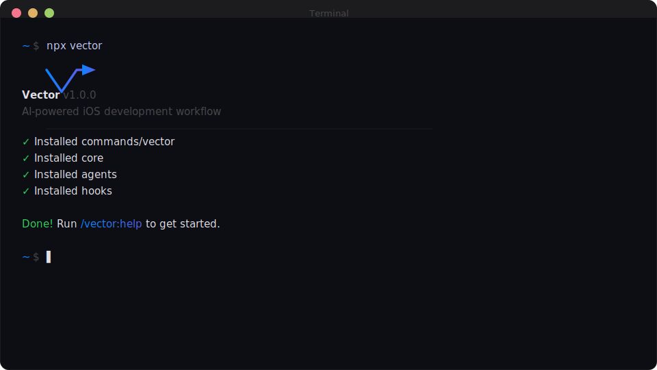

<div align="center">

# Vector

**English** · [简体中文](README.zh-CN.md)

**A light-weight and powerful meta-prompting, context engineering and spec-driven development system for iOS Development.**

**Solves context rot — the quality degradation that happens as Claude fills its context window.**

[](https://www.npmjs.com/package/vector)
[](https://www.npmjs.com/package/vector)
[](https://github.com/glittercowboy/core/actions/workflows/test.yml)
[](https://discord.gg/gsd)
[](https://x.com/gsd_foundation)
[](https://dexscreener.com/solana/dwudwjvan7bzkw9zwlbyv6kspdlvhwzrqy6ebk8xzxkv)
[](https://github.com/glittercowboy/core)
[](LICENSE)

<br>

```bash
npx vector@latest
```

**Works on Mac, Windows, and Linux.**

<br>



<br>

*"If you know clearly what you want, this WILL build it for you. No bs."*

*"I've done SpecKit, OpenSpec and Taskmaster — this has produced the best results for me."*

*"By far the most powerful addition to my Claude Code. Nothing over-engineered. Literally just gets shit done."*

<br>

**Trusted by engineers at Amazon, Google, Shopify, and Webflow.**

[Why I Built This](#why-i-built-this) · [How It Works](#how-it-works) · [Commands](#commands) · [Why It Works](#why-it-works) · [User Guide](docs/USER-GUIDE.md)

</div>

---

## Why I Built This

I no longer write code — Claude Code does.

Other spec-driven development tools exist; BMAD, Speckit... But they all seem to make things way more complicated than they need to be (sprint ceremonies, story points, stakeholder syncs, retrospectives, Jira workflows) or lack real big picture understanding of what you're building. I'm not a 50-person software company. I don't want to play enterprise theater. I'm just a creative person trying to build great things that work.

So I built Vector. The complexity is in the system, not in your workflow. Behind the scenes: context engineering, XML prompt formatting, subagent orchestration, state management. What you see: a few commands that just work.

The system gives Claude everything it needs to do the work *and* verify it. I trust the workflow. It just does a good job.

That's what this is. No enterprise roleplay bullshit. Just an incredibly effective system for building cool stuff consistently using Claude Code.

— **TÂCHES**

---

Vibecoding has a bad reputation. You describe what you want, AI generates code, and you get inconsistent garbage that falls apart at scale.

Vector fixes that. It's the context engineering layer that makes Claude Code reliable. Describe your idea, let the system extract everything it needs to know, and let Claude Code get to work.

---

## Who This Is For

People who want to describe what they want and have it built correctly — without pretending they're running a 50-person engineering org.

---

## Getting Started

```bash
npx vector@latest
```

The installer prompts you to choose:
1. **Runtime** — Claude Code, OpenCode, Gemini, Codex, Copilot, Antigravity, or all
2. **Location** — Global (all projects) or local (current project only)

Verify with:
- Claude Code / Gemini: `/vector:help`
- OpenCode: `/vector-help`
- Codex: `$vector-help`
- Copilot: `/vector:help`

> [!NOTE]
> Codex installation uses skills (`skills/vector-*/SKILL.md`) rather than custom prompts.

### Staying Updated

Vector evolves fast. Update periodically:

```bash
npx vector@latest
```

<details>
<summary><strong>Non-interactive Install (Docker, CI, Scripts)</strong></summary>

```bash
# Claude Code
npx vector --claude --global   # Install to ~/.claude/
npx vector --claude --local    # Install to ./.claude/

# OpenCode (open source, free models)
npx vector --opencode --global # Install to ~/.config/opencode/

# Gemini CLI
npx vector --gemini --global   # Install to ~/.gemini/

# Codex (skills-first)
npx vector --codex --global    # Install to ~/.codex/
npx vector --codex --local     # Install to ./.codex/

# Copilot (GitHub Copilot CLI)
npx vector --copilot --global  # Install to ~/.github/
npx vector --copilot --local   # Install to ./.github/

# Antigravity (Google, skills-first, Gemini-based)
npx vector --antigravity --global # Install to ~/.gemini/antigravity/
npx vector --antigravity --local  # Install to ./.agent/

# All runtimes
npx vector --all --global      # Install to all directories
```

Use `--global` (`-g`) or `--local` (`-l`) to skip the location prompt.
Use `--claude`, `--opencode`, `--gemini`, `--codex`, `--copilot`, `--antigravity`, or `--all` to skip the runtime prompt.

</details>

<details>
<summary><strong>Development Installation</strong></summary>

Clone the repository and run the installer locally:

```bash
git clone https://github.com/glittercowboy/core.git
cd core
node bin/install.js --claude --local
```

Installs to `./.claude/` for testing modifications before contributing.

</details>

### Recommended: Skip Permissions Mode

Vector is designed for frictionless automation. Run Claude Code with:

```bash
claude --dangerously-skip-permissions
```

> [!TIP]
> This is how Vector is intended to be used — stopping to approve `date` and `git commit` 50 times defeats the purpose.

<details>
<summary><strong>Alternative: Granular Permissions</strong></summary>

If you prefer not to use that flag, add this to your project's `.claude/settings.json`:

```json
{
  "permissions": {
    "allow": [
      "Bash(date:*)",
      "Bash(echo:*)",
      "Bash(cat:*)",
      "Bash(ls:*)",
      "Bash(mkdir:*)",
      "Bash(wc:*)",
      "Bash(head:*)",
      "Bash(tail:*)",
      "Bash(sort:*)",
      "Bash(grep:*)",
      "Bash(tr:*)",
      "Bash(git add:*)",
      "Bash(git commit:*)",
      "Bash(git status:*)",
      "Bash(git log:*)",
      "Bash(git diff:*)",
      "Bash(git tag:*)"
    ]
  }
}
```

</details>

---

## How It Works

> **Already have code?** Run `/vector:map-codebase` first. It spawns parallel agents to analyze your stack, architecture, conventions, and concerns. Then `/vector:new-project` knows your codebase — questions focus on what you're adding, and planning automatically loads your patterns.

### 1. Initialize Project

```
/vector:new-project
```

One command, one flow. The system:

1. **Questions** — Asks until it understands your idea completely (goals, constraints, tech preferences, edge cases)
2. **Research** — Spawns parallel agents to investigate the domain (optional but recommended)
3. **Requirements** — Extracts what's v1, v2, and out of scope
4. **Roadmap** — Creates phases mapped to requirements

You approve the roadmap. Now you're ready to build.

**Creates:** `PROJECT.md`, `REQUIREMENTS.md`, `ROADMAP.md`, `STATE.md`, `.planning/research/`

---

### 2. Discuss Phase

```
/vector:discuss-phase 1
```

**This is where you shape the implementation.**

Your roadmap has a sentence or two per phase. That's not enough context to build something the way *you* imagine it. This step captures your preferences before anything gets researched or planned.

The system analyzes the phase and identifies gray areas based on what's being built:

- **Visual features** → Layout, density, interactions, empty states
- **APIs/CLIs** → Response format, flags, error handling, verbosity
- **Content systems** → Structure, tone, depth, flow
- **Organization tasks** → Grouping criteria, naming, duplicates, exceptions

For each area you select, it asks until you're satisfied. The output — `CONTEXT.md` — feeds directly into the next two steps:

1. **Researcher reads it** — Knows what patterns to investigate ("user wants card layout" → research card component libraries)
2. **Planner reads it** — Knows what decisions are locked ("infinite scroll decided" → plan includes scroll handling)

The deeper you go here, the more the system builds what you actually want. Skip it and you get reasonable defaults. Use it and you get *your* vision.

**Creates:** `{phase_num}-CONTEXT.md`

---

### 3. Plan Phase

```
/vector:plan-phase 1
```

The system:

1. **Researches** — Investigates how to implement this phase, guided by your CONTEXT.md decisions
2. **Plans** — Creates 2-3 atomic task plans with XML structure
3. **Verifies** — Checks plans against requirements, loops until they pass

Each plan is small enough to execute in a fresh context window. No degradation, no "I'll be more concise now."

**Creates:** `{phase_num}-RESEARCH.md`, `{phase_num}-{N}-PLAN.md`

---

### 4. Execute Phase

```
/vector:execute-phase 1
```

The system:

1. **Runs plans in waves** — Parallel where possible, sequential when dependent
2. **Fresh context per plan** — 200k tokens purely for implementation, zero accumulated garbage
3. **Commits per task** — Every task gets its own atomic commit
4. **Verifies against goals** — Checks the codebase delivers what the phase promised

Walk away, come back to completed work with clean git history.

**How Wave Execution Works:**

Plans are grouped into "waves" based on dependencies. Within each wave, plans run in parallel. Waves run sequentially.

```
┌────────────────────────────────────────────────────────────────────┐
│  PHASE EXECUTION                                                   │
├────────────────────────────────────────────────────────────────────┤
│                                                                    │
│  WAVE 1 (parallel)          WAVE 2 (parallel)          WAVE 3      │
│  ┌─────────┐ ┌─────────┐    ┌─────────┐ ┌─────────┐    ┌─────────┐ │
│  │ Plan 01 │ │ Plan 02 │ →  │ Plan 03 │ │ Plan 04 │ →  │ Plan 05 │ │
│  │         │ │         │    │         │ │         │    │         │ │
│  │ User    │ │ Product │    │ Orders  │ │ Cart    │    │ Checkout│ │
│  │ Model   │ │ Model   │    │ API     │ │ API     │    │ UI      │ │
│  └─────────┘ └─────────┘    └─────────┘ └─────────┘    └─────────┘ │
│       │           │              ↑           ↑              ↑      │
│       └───────────┴──────────────┴───────────┘              │      │
│              Dependencies: Plan 03 needs Plan 01            │      │
│                          Plan 04 needs Plan 02              │      │
│                          Plan 05 needs Plans 03 + 04        │      │
│                                                                    │
└────────────────────────────────────────────────────────────────────┘
```

**Why waves matter:**
- Independent plans → Same wave → Run in parallel
- Dependent plans → Later wave → Wait for dependencies
- File conflicts → Sequential plans or same plan

This is why "vertical slices" (Plan 01: User feature end-to-end) parallelize better than "horizontal layers" (Plan 01: All models, Plan 02: All APIs).

**Creates:** `{phase_num}-{N}-SUMMARY.md`, `{phase_num}-VERIFICATION.md`

---

### 5. Verify Work

```
/vector:verify-work 1
```

**This is where you confirm it actually works.**

Automated verification checks that code exists and tests pass. But does the feature *work* the way you expected? This is your chance to use it.

The system:

1. **Extracts testable deliverables** — What you should be able to do now
2. **Walks you through one at a time** — "Can you log in with email?" Yes/no, or describe what's wrong
3. **Diagnoses failures automatically** — Spawns debug agents to find root causes
4. **Creates verified fix plans** — Ready for immediate re-execution

If everything passes, you move on. If something's broken, you don't manually debug — you just run `/vector:execute-phase` again with the fix plans it created.

**Creates:** `{phase_num}-UAT.md`, fix plans if issues found

---

### 6. Repeat → Complete → Next Milestone

```
/vector:discuss-phase 2
/vector:plan-phase 2
/vector:execute-phase 2
/vector:verify-work 2
...
/vector:complete-milestone
/vector:new-milestone
```

Loop **discuss → plan → execute → verify** until milestone complete.

If you want faster intake during discussion, use `/vector:discuss-phase <n> --batch` to answer a small grouped set of questions at once instead of one-by-one.

Each phase gets your input (discuss), proper research (plan), clean execution (execute), and human verification (verify). Context stays fresh. Quality stays high.

When all phases are done, `/vector:complete-milestone` archives the milestone and tags the release.

Then `/vector:new-milestone` starts the next version — same flow as `new-project` but for your existing codebase. You describe what you want to build next, the system researches the domain, you scope requirements, and it creates a fresh roadmap. Each milestone is a clean cycle: define → build → ship.

---

### Quick Mode

```
/vector:quick
```

**For ad-hoc tasks that don't need full planning.**

Quick mode gives you Vector guarantees (atomic commits, state tracking) with a faster path:

- **Same agents** — Planner + executor, same quality
- **Skips optional steps** — No research, no plan checker, no verifier by default
- **Separate tracking** — Lives in `.planning/quick/`, not phases

**`--discuss` flag:** Lightweight discussion to surface gray areas before planning.

**`--research` flag:** Spawns a focused researcher before planning. Investigates implementation approaches, library options, and pitfalls. Use when you're unsure how to approach a task.

**`--full` flag:** Enables plan-checking (max 2 iterations) and post-execution verification.

Flags are composable: `--discuss --research --full` gives discussion + research + plan-checking + verification.

```
/vector:quick
> What do you want to do? "Add dark mode toggle to settings"
```

**Creates:** `.planning/quick/001-add-dark-mode-toggle/PLAN.md`, `SUMMARY.md`

---

## Why It Works

### Context Engineering

Claude Code is incredibly powerful *if* you give it the context it needs. Most people don't.

Vector handles it for you:

| File | What it does |
|------|--------------|
| `PROJECT.md` | Project vision, always loaded |
| `research/` | Ecosystem knowledge (stack, features, architecture, pitfalls) |
| `REQUIREMENTS.md` | Scoped v1/v2 requirements with phase traceability |
| `ROADMAP.md` | Where you're going, what's done |
| `STATE.md` | Decisions, blockers, position — memory across sessions |
| `PLAN.md` | Atomic task with XML structure, verification steps |
| `SUMMARY.md` | What happened, what changed, committed to history |
| `todos/` | Captured ideas and tasks for later work |

Size limits based on where Claude's quality degrades. Stay under, get consistent excellence.

### XML Prompt Formatting

Every plan is structured XML optimized for Claude:

```xml
<task type="auto">
  <name>Create login endpoint</name>
  <files>src/app/api/auth/login/route.ts</files>
  <action>
    Use jose for JWT (not jsonwebtoken - CommonJS issues).
    Validate credentials against users table.
    Return httpOnly cookie on success.
  </action>
  <verify>curl -X POST localhost:3000/api/auth/login returns 200 + Set-Cookie</verify>
  <done>Valid credentials return cookie, invalid return 401</done>
</task>
```

Precise instructions. No guessing. Verification built in.

### Multi-Agent Orchestration

Every stage uses the same pattern: a thin orchestrator spawns specialized agents, collects results, and routes to the next step.

| Stage | Orchestrator does | Agents do |
|-------|------------------|-----------|
| Research | Coordinates, presents findings | 4 parallel researchers investigate stack, features, architecture, pitfalls |
| Planning | Validates, manages iteration | Planner creates plans, checker verifies, loop until pass |
| Execution | Groups into waves, tracks progress | Executors implement in parallel, each with fresh 200k context |
| Verification | Presents results, routes next | Verifier checks codebase against goals, debuggers diagnose failures |

The orchestrator never does heavy lifting. It spawns agents, waits, integrates results.

**The result:** You can run an entire phase — deep research, multiple plans created and verified, thousands of lines of code written across parallel executors, automated verification against goals — and your main context window stays at 30-40%. The work happens in fresh subagent contexts. Your session stays fast and responsive.

### Atomic Git Commits

Each task gets its own commit immediately after completion:

```bash
abc123f docs(08-02): complete user registration plan
def456g feat(08-02): add email confirmation flow
hij789k feat(08-02): implement password hashing
lmn012o feat(08-02): create registration endpoint
```

> [!NOTE]
> **Benefits:** Git bisect finds exact failing task. Each task independently revertable. Clear history for Claude in future sessions. Better observability in AI-automated workflow.

Every commit is surgical, traceable, and meaningful.

### Modular by Design

- Add phases to current milestone
- Insert urgent work between phases
- Complete milestones and start fresh
- Adjust plans without rebuilding everything

You're never locked in. The system adapts.

---

## Commands

### Core Workflow

| Command | What it does |
|---------|--------------|
| `/vector:new-project [--auto]` | Full initialization: questions → research → requirements → roadmap |
| `/vector:discuss-phase [N] [--auto]` | Capture implementation decisions before planning |
| `/vector:plan-phase [N] [--auto]` | Research + plan + verify for a phase |
| `/vector:execute-phase <N>` | Execute all plans in parallel waves, verify when complete |
| `/vector:verify-work [N]` | Manual user acceptance testing ¹ |
| `/vector:audit-milestone` | Verify milestone achieved its definition of done |
| `/vector:complete-milestone` | Archive milestone, tag release |
| `/vector:new-milestone [name]` | Start next version: questions → research → requirements → roadmap |

### UI Design

| Command | What it does |
|---------|--------------|
| `/vector:ui-phase [N]` | Generate UI design contract (UI-SPEC.md) for frontend phases |
| `/vector:ui-review [N]` | Retroactive 6-pillar visual audit of implemented frontend code |

### Navigation

| Command | What it does |
|---------|--------------|
| `/vector:progress` | Where am I? What's next? |
| `/vector:help` | Show all commands and usage guide |
| `/vector:update` | Update Vector with changelog preview |
| `/vector:join-discord` | Join the Vector Discord community |

### Brownfield

| Command | What it does |
|---------|--------------|
| `/vector:map-codebase [area]` | Analyze existing codebase before new-project |

### Phase Management

| Command | What it does |
|---------|--------------|
| `/vector:add-phase` | Append phase to roadmap |
| `/vector:insert-phase [N]` | Insert urgent work between phases |
| `/vector:remove-phase [N]` | Remove future phase, renumber |
| `/vector:list-phase-assumptions [N]` | See Claude's intended approach before planning |
| `/vector:plan-milestone-gaps` | Create phases to close gaps from audit |

### Session

| Command | What it does |
|---------|--------------|
| `/vector:pause-work` | Create handoff when stopping mid-phase |
| `/vector:resume-work` | Restore from last session |

### Utilities

| Command | What it does |
|---------|--------------|
| `/vector:settings` | Configure model profile and workflow agents |
| `/vector:set-profile <profile>` | Switch model profile (quality/balanced/budget/inherit) |
| `/vector:add-todo [desc]` | Capture idea for later |
| `/vector:check-todos` | List pending todos |
| `/vector:debug [desc]` | Systematic debugging with persistent state |
| `/vector:quick [--full] [--discuss] [--research]` | Execute ad-hoc task with Vector guarantees (`--full` adds plan-checking and verification, `--discuss` gathers context first, `--research` investigates approaches before planning) |
| `/vector:health [--repair]` | Validate `.planning/` directory integrity, auto-repair with `--repair` |
| `/vector:stats` | Display project statistics — phases, plans, requirements, git metrics |

<sup>¹ Contributed by reddit user OracleGreyBeard</sup>

---

## Configuration

Vector stores project settings in `.planning/config.json`. Configure during `/vector:new-project` or update later with `/vector:settings`. For the full config schema, workflow toggles, git branching options, and per-agent model breakdown, see the [User Guide](docs/USER-GUIDE.md#configuration-reference).

### Core Settings

| Setting | Options | Default | What it controls |
|---------|---------|---------|------------------|
| `mode` | `yolo`, `interactive` | `interactive` | Auto-approve vs confirm at each step |
| `granularity` | `coarse`, `standard`, `fine` | `standard` | Phase granularity — how finely scope is sliced (phases × plans) |

### Model Profiles

Control which Claude model each agent uses. Balance quality vs token spend.

| Profile | Planning | Execution | Verification |
|---------|----------|-----------|--------------|
| `quality` | Opus | Opus | Sonnet |
| `balanced` (default) | Opus | Sonnet | Sonnet |
| `budget` | Sonnet | Sonnet | Haiku |
| `inherit` | Inherit | Inherit | Inherit |

Switch profiles:
```
/vector:set-profile budget
```

Use `inherit` to follow the current runtime model selection (for example OpenCode `/model`).

Or configure via `/vector:settings`.

### Workflow Agents

These spawn additional agents during planning/execution. They improve quality but add tokens and time.

| Setting | Default | What it does |
|---------|---------|--------------|
| `workflow.research` | `true` | Researches domain before planning each phase |
| `workflow.plan_check` | `true` | Verifies plans achieve phase goals before execution |
| `workflow.verifier` | `true` | Confirms must-haves were delivered after execution |
| `workflow.auto_advance` | `false` | Auto-chain discuss → plan → execute without stopping |

Use `/vector:settings` to toggle these, or override per-invocation:
- `/vector:plan-phase --skip-research`
- `/vector:plan-phase --skip-verify`

### Execution

| Setting | Default | What it controls |
|---------|---------|------------------|
| `parallelization.enabled` | `true` | Run independent plans simultaneously |
| `planning.commit_docs` | `true` | Track `.planning/` in git |

### Git Branching

Control how Vector handles branches during execution.

| Setting | Options | Default | What it does |
|---------|---------|---------|--------------|
| `git.branching_strategy` | `none`, `phase`, `milestone` | `none` | Branch creation strategy |
| `git.phase_branch_template` | string | `vector/phase-{phase}-{slug}` | Template for phase branches |
| `git.milestone_branch_template` | string | `vector/{milestone}-{slug}` | Template for milestone branches |

**Strategies:**
- **`none`** — Commits to current branch (default Vector behavior)
- **`phase`** — Creates a branch per phase, merges at phase completion
- **`milestone`** — Creates one branch for entire milestone, merges at completion

At milestone completion, Vector offers squash merge (recommended) or merge with history.

---

## Security

### Protecting Sensitive Files

Vector's codebase mapping and analysis commands read files to understand your project. **Protect files containing secrets** by adding them to Claude Code's deny list:

1. Open Claude Code settings (`.claude/settings.json` or global)
2. Add sensitive file patterns to the deny list:

```json
{
  "permissions": {
    "deny": [
      "Read(.env)",
      "Read(.env.*)",
      "Read(**/secrets/*)",
      "Read(**/*credential*)",
      "Read(**/*.pem)",
      "Read(**/*.key)"
    ]
  }
}
```

This prevents Claude from reading these files entirely, regardless of what commands you run.

> [!IMPORTANT]
> Vector includes built-in protections against committing secrets, but defense-in-depth is best practice. Deny read access to sensitive files as a first line of defense.

---

## Troubleshooting

**Commands not found after install?**
- Restart your runtime to reload commands/skills
- Verify files exist in `~/.claude/commands/vector/` (global) or `./.claude/commands/vector/` (local)
- For Codex, verify skills exist in `~/.codex/skills/vector-*/SKILL.md` (global) or `./.codex/skills/vector-*/SKILL.md` (local)

**Commands not working as expected?**
- Run `/vector:help` to verify installation
- Re-run `npx vector` to reinstall

**Updating to the latest version?**
```bash
npx vector@latest
```

**Using Docker or containerized environments?**

If file reads fail with tilde paths (`~/.claude/...`), set `CLAUDE_CONFIG_DIR` before installing:
```bash
CLAUDE_CONFIG_DIR=/home/youruser/.claude npx vector --global
```
This ensures absolute paths are used instead of `~` which may not expand correctly in containers.

### Uninstalling

To remove Vector completely:

```bash
# Global installs
npx vector --claude --global --uninstall
npx vector --opencode --global --uninstall
npx vector --codex --global --uninstall
npx vector --copilot --global --uninstall

# Local installs (current project)
npx vector --claude --local --uninstall
npx vector --opencode --local --uninstall
npx vector --codex --local --uninstall
npx vector --copilot --local --uninstall
```

This removes all Vector commands, agents, hooks, and settings while preserving your other configurations.

---

## Community Ports

OpenCode, Gemini CLI, and Codex are now natively supported via `npx vector`.

These community ports pioneered multi-runtime support:

| Project | Platform | Description |
|---------|----------|-------------|
| [vector-opencode](https://github.com/rokicool/vector-opencode) | OpenCode | Original OpenCode adaptation |
| vector-gemini (archived) | Gemini CLI | Original Gemini adaptation by uberfuzzy |

---

## Star History

<a href="https://star-history.com/#glittercowboy/core&Date">
 <picture>
   <source media="(prefers-color-scheme: dark)" srcset="https://api.star-history.com/svg?repos=glittercowboy/core&type=Date&theme=dark" />
   <source media="(prefers-color-scheme: light)" srcset="https://api.star-history.com/svg?repos=glittercowboy/core&type=Date" />
   
 </picture>
</a>

---

## License

MIT License. See [LICENSE](LICENSE) for details.

---

<div align="center">

**Claude Code is powerful. Vector makes it reliable.**

</div>
